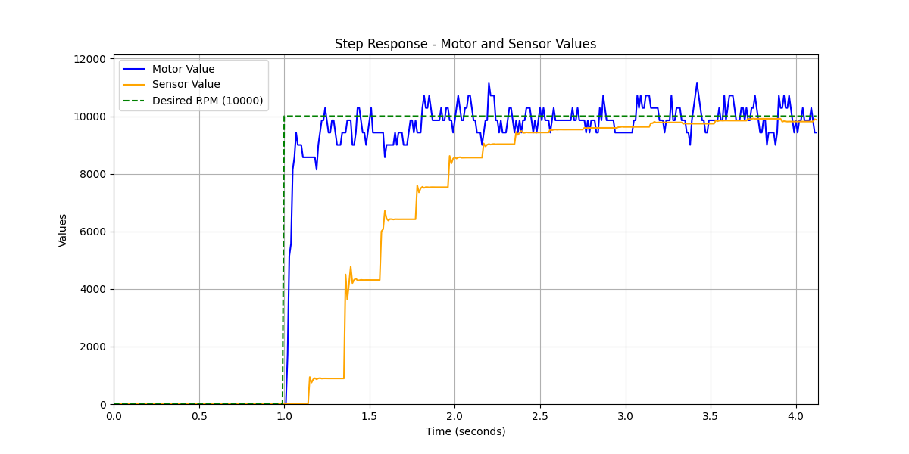

# Controller Network
## Part 1
For the calculation of the minimal response time we use the Baudrate from the lecture of Modbus RTU which is 115200 bits per second. For the message we use 8 Bytes per message. Well need a request and a response until we can update so the formula is:

$$
\frac{1}{115200\frac{bits}{s}}\cdot (8 \cdot 8 \cdot 2) bits = 0.00006944 s \approx 0.00007 s = 70 us
$$
We round to 70 us for having time for the bus idle.
The sensor works as follows: A piece of paper spins around at a certain spot on the wheel everytime the wheel spins one time it will darken a lightsensitive Resistor. An Analog pin measures the voltage difference which appears when the resistor has no light an from that we can determine the spinning speed. The test task is to compare the both sensore values the one of the sensor built into the motor and the lightsensitive sensor.

### Messages
Messages are built up as follows: 
 - 1 Byte: ID of the Responder: 01 (Motor) or 02 (Sensor)
 - 2 Byte: ID of the Task: 03 (read) or 06 (write)
 - 3 & 4 Byte: Address 
 - 5 & 6 Byte: Message
 - 7 & 8 Byte: CRC

 Address:
 - Motor: Control state:  0001, RPM 0005, Set Speed 0009
 - Sensor: Read Value: 0006 
    
 Message: Data  
 CRC: Calculated

Error codes are directly taken from the modbus RTU protocol:  
illegal_func = 0x01  
illegal_addr = 0x02  
illegal_data = 0x03  
device_fail = 0x04  

### Protocol difference
For transmitting errors, the protocol does not comply with the official modbus protocol. For simplicity it was decided to only use 8 byte messages. 

The developed protocol is transmitting the error code in the message field, and it also sets the highes bit in the task id byte. The address field will be not changed and the crc is calculated as usual for the transmitted values. Examples screenshots from the oscilloscope can be seen in [Part 3](#exceptions).

## Part 2

### Testing 
For testing the serial communication, the code from Assignment 5.2 was used.

### simulating crc error

#### RPi is sending wrong crc value

Message is ignored from Arduino

CH1: RX line Arduino  
CH2: TX line Arduino  
Bus table: request was sent to write value 128 at address 1; Arduino does not respond to this valid message, because the CRC value is wrong

#### Arduino is sending a wrong crc in the answer

CH1: RX line Arduino  
CH2: TX line Arduino  
Bus table: request was sent to write value 128 at address 1; Arduino responds with a wrong crc value  

Print from linux terminal:

    pi@rpi-matthiasr24:~/Controller_network/Master_Rpi $ ./modbus 1 6 1 128
    Sent request: 01 06 0001 0080 aad9
    CRC Error, will not use message. Received: 0xaada Calculated: 0xaad9

## Part 3

### Exceptions

#### Illegal Data Address

CH1: RX line Arduino  
CH2: TX line Arduino  
Bus table: request was sent to write value 120 at address 1, Arduino responds with illegal data response message in the data field  

#### Illegal Data Value

CH1: RX line Arduino  
CH2: TX line Arduino  
Bus table: request was sent to write value 120 at address 1, Arduino responds with illegal data response message in the data field  

#### Illegal Function

CH1: RX line Arduino  
CH2: TX line Arduino  
Bus table: request was sent for function 4, Arduino responds with illegal function response message in the data field.

### systemd
With the systemd file controller.service the programm main.cpp starts automatically when the raspberry is booting.

### print
In the printOut.txt is a sample output of the programm. It shows the status change of the motor in the beginning and prints the calculated RPM of the Motor and the Sensor value. 

## Part 4
The following Diagram shows the programm:

On the following figure the Step response is shown with both sensors displaying the RPM:

YouTube: https://youtu.be/4T9cs9V0CYY?si=DkrCI6loCEgpb1c4   
GitHub: https://github.com/UniRoi/Controller_network

